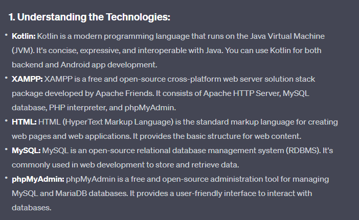

> Brainstorming Project Ideas

java --> kotlin 
XAMPP
- setup a server on computer
 - use html
 - mySql
- phpMyAdmin

Kotlin ( bug tracker)
- put bugs into list/array
- upgrade bug tracker to use a database
- android studio apps

Swift
- iphone apps

Api's 
- ip address lookup
- imdb clone
- bug tracker/ producrt tracker

google adwords
crime stats
job board


> How does all this information come together?




```
1. Personal Finance Tracker:
Create a web application where users can log in, enter their daily expenses and income, and track their financial activities. Store the data in a MySQL database and use Kotlin for the backend logic. Use HTML and CSS for the frontend, and XAMPP to host the application locally.

2. Task Management System:
Build a task management system where users can create, update, and delete tasks. Users can log in to view their tasks and mark them as completed. Store task data in MySQL, use Kotlin for backend logic, and create a responsive web interface using HTML and CSS. XAMPP can host the web application, and phpMyAdmin can help manage the database.

3. Recipe Sharing Platform:
Develop a platform where users can share and explore recipes. Users can create accounts, add new recipes, comment on recipes, and rate them. Use Kotlin for backend processing, HTML and CSS for the frontend design, and MySQL for storing recipe data. XAMPP can host the application locally, and phpMyAdmin can be used for database management.

4. Online Quiz Platform:
Build an interactive online quiz platform where users can take quizzes on various topics. Admins can create quizzes, manage questions, and view results. Use Kotlin for backend logic, HTML and CSS for frontend design, MySQL for storing quiz and user data, and XAMPP for hosting the platform locally. phpMyAdmin can help manage the database.

5. E-commerce Website:
Create a fully functional e-commerce website where users can browse products, add them to the cart, proceed to checkout, and make purchases. Implement user authentication, product management, and order processing. Use Kotlin for backend development, HTML/CSS for frontend, and MySQL to store product and user data. XAMPP can host the application, and phpMyAdmin can manage the database.

6. Health and Fitness Tracker:
Develop a health and fitness tracking application where users can log their daily activities, meals, and exercises. Provide charts and statistics to visualize progress. Use Kotlin for backend logic, HTML and CSS for frontend, MySQL for data storage, and XAMPP for hosting the application. phpMyAdmin can be used for database management.

7. Language Learning Platform:
Build an interactive language learning platform with lessons, quizzes, and progress tracking. Users can register, select languages, and track their learning progress. Use Kotlin for backend processing, HTML/CSS for frontend design, MySQL for storing user and language data, and XAMPP for hosting the application. phpMyAdmin can assist in managing the database.

```
